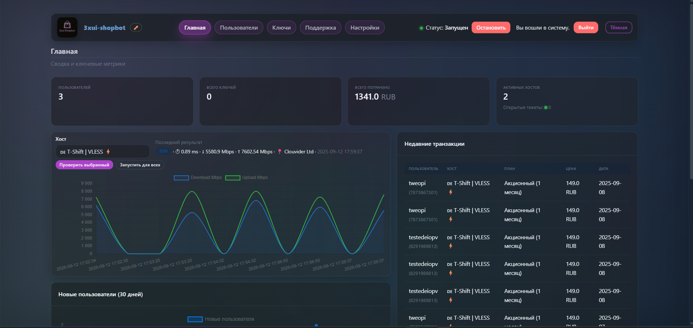
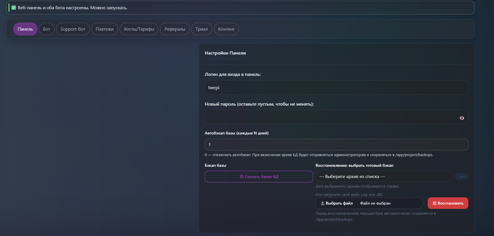
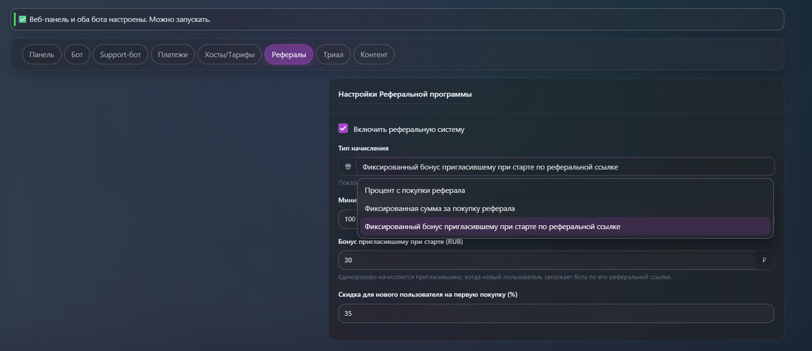
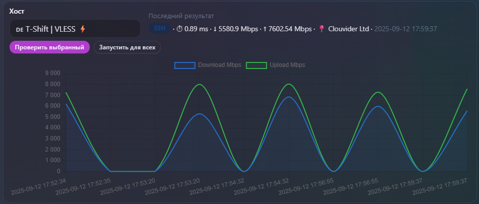
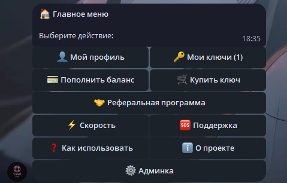
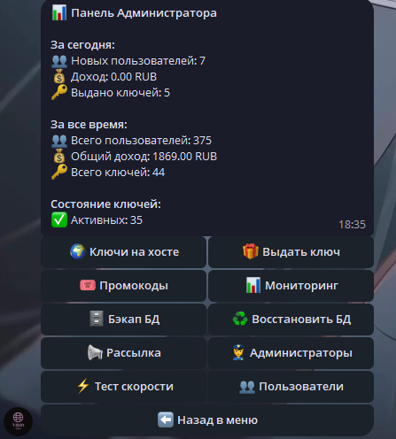
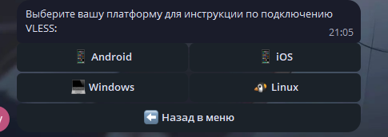
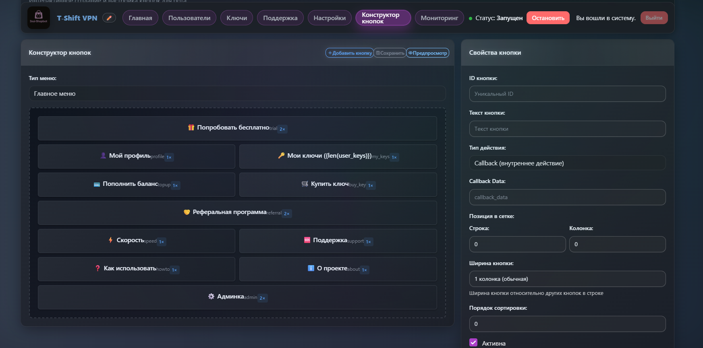
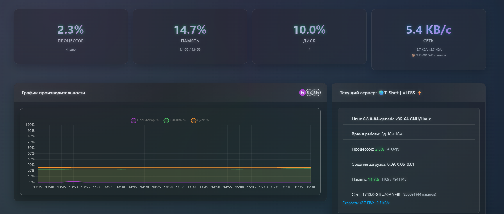
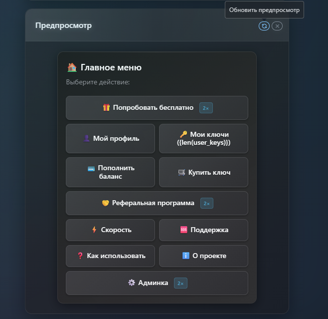

<div align="center" markdown>
      <h1>3X-ui-ShopBot | Telegram-бот для продажи VPN</h1>
<p align="center">
    <a href="https://github.com/tweopi/3xui-shopbot?tab=readme-ov-file#%EF%B8%8F-%D1%83%D1%81%D1%82%D0%B0%D0%BD%D0%BE%D0%B2%D0%BA%D0%B0-%D0%BF%D0%BE%D0%B4-%D0%BA%D0%BB%D1%8E%D1%87">Установка и обновление</a> •
    <a href="https://github.com/tweopi/3xui-shopbot?tab=readme-ov-file#-%D0%B1%D0%B0%D0%B3%D0%B8-%D0%B8-%D0%BF%D1%80%D0%B5%D0%B4%D0%BB%D0%BE%D0%B6%D0%B5%D0%BD%D0%B8%D1%8F">Баги и предложения</a> •
    <a href="#%D0%BF%D0%BE%D0%B4%D0%B4%D0%B5%D1%80%D0%B6%D0%BA%D0%B0-%D0%BF%D0%BE-%D0%BF%D1%80%D0%BE%D0%B5%D0%BA%D1%82%D1%83">Поддержка по проекту</a> •
    <a href="https://t.me/+0a2q3H5G7JU4NDMy">Группа для соискателей</a> •
    <a href="https://github.com/tweopi/3xui-shopbot?tab=readme-ov-file#-%D0%B1%D0%B0%D0%B3%D0%B8-%D0%B8-%D0%BF%D1%80%D0%B5%D0%B4%D0%BB%D0%BE%D0%B6%D0%B5%D0%BD%D0%B8%D1%8F">Поддержать проект</a>
</p>
<p align="center">
  
  
  
  
  
  
  
</p>
</div>

**3X-ui-ShopBot** — комплексное решение для автоматизированной продажи VLESS‑конфигураций через Telegram с глубокой интеграцией в панель **3x‑ui** и собственной веб‑панелью на базе Tabler.

## [Поддержка по проекту](https://t.me/t_shift_supportbot)

## 👥 Группа для соискателей

Присоединяйтесь к нашей группе: [3xui-shopbot](https://t.me/+0a2q3H5G7JU4NDMy)

---

## 🚀 Возможности

- Полная автоматизация: от регистрации до выдачи ключа после оплаты.
- Веб‑панель «все‑в‑одном»: сервера, тарифы, пользователи, платежи, логи, спидтесты.
- Мульти‑хост: любое число серверов 3x‑ui, централизованное управление.
- Гибкие тарифы: месяцы/цена для каждого хоста.
- Платежи: YooKassa, CryptoBot, Heleket, TON Connect (опционально чеки YooKassa).
- Принудительная подписка на канал.
- Тестовый период (trial).
- Реферальная система (несколько типов начислений).
- Встроенная поддержка: внешний саппорт‑бот либо контакт пользователя.
- Тест скорости по хостам: SSH‑speedtest + сетевой Net‑Probe.

---

## 🖼️ Скриншоты

<details>
  <summary><b>Показать скриншоты</b></summary>
  
  <br>
  
  <table>
    <tr>
      <td align="center" valign="top">
        <a href="docs/screenshots/dashboard.png"></a><br>
        <sub>Панель — Дашборд</sub>
      </td>
      <td align="center" valign="top">
        <a href="docs/screenshots/settings.png"></a><br>
        <sub>Панель — Настройки</sub>
      </td>
    </tr>
    <tr>
      <td align="center" valign="top">
        <a href="docs/screenshots/referrals.png"></a><br>
        <sub>Рефералы</sub>
      </td>
      <td align="center" valign="top">
        <a href="docs/screenshots/speedtests.png"></a><br>
        <sub>Спидтесты</sub>
      </td>
    </tr>
    <tr>
      <td align="center" valign="top">
        <a href="docs/screenshots/bot-main-menu.png"></a><br>
        <sub>Бот — Главное меню</sub>
      </td>
      <td align="center" valign="top">
        <a href="docs/screenshots/bot-admin-menu.png"></a><br>
        <sub>Бот — Админ‑меню</sub>
      </td>
    </tr>
    <tr>
      <td align="center" valign="top">
        <a href="docs/screenshots/bot-settings.png"></a><br>
        <sub>Бот — Настройки/Помощь</sub>
      </td>
      <td align="center" valign="top">
        <a href="docs/screenshots/button_design.png"></a><br>
        <sub>Панель — Конструктор кнопок</sub>
      </td>
    </tr>
    <tr>
      <td align="center" valign="top">
        <a href="docs/screenshots/monitor.png"></a><br>
        <sub>Панель — Мониторинг</sub>
      </td>
      <td align="center" valign="top">
        <a href="docs/screenshots/preview.png"></a><br>
        <sub>Панель — Предпросмотр меню</sub>
      </td>
    </tr>
  </table>
 
  <br>
  <i>Клик по миниатюре откроет оригинал в полном размере.</i>
</details>

---

## ⚠️ Требования

1) Сервер Ubuntu/Debian с доступом по SSH.
2) Домен, A‑запись которого уже указывает на IP сервера.
3) Установленная панель 3x‑ui на одном или нескольких серверах.

---

## 💻 Где купить сервер/домен

Если нет сервера/домена — можно приобрести здесь: [Hostoff](https://hostoff.net/vps?ref=CODEA251D760)

---

## 🛠️ Установка «под ключ»

Скрипт поставит Docker, Nginx, Certbot, скачает и развернёт бота и панель.

1) Подключитесь по SSH.

2) Выполните:

```bash
curl -sSL https://raw.githubusercontent.com/tweopi/3xui-shopbot/main/install.sh | sudo bash
```

3) Следуйте инструкциям установщика:

- Введите домен (например, `shop.example.com`).
- Укажите email для SSL (Let's Encrypt).
- Скрипт автоматически поднимет контейнеры и выпишет сертификат.

4) По завершении получите URL панели и первичные доступы:

```
Веб‑панель: https://your-domain.com/login
Логин: admin
Пароль: admin
```

---

## ⚙️ Первичная настройка

1) Войдите в панель (`https://your-domain.com/login`) и сразу смените логин/пароль в «Настройки → Настройки панели».
2) Заполните Telegram‑параметры: `Токен бота`, `Имя телеграмм бота`, `ID администратора в телеграмме`.
3) Добавьте хост 3x‑ui в «Настройки → Управление хостами» (URL панели, логин/пароль 3x‑ui, inbound id).
4) Создайте тарифы для добавленного хоста (месяцы/цена).
5) Сохраните настройки и нажмите «Запустить бота» в шапке панели.

Бот готов к работе.

---

## 💳 Платёжные системы

Откройте «Настройки → Настройки платёжных систем» и заполните соответствующие поля.

### YooKassa

- Укажите `yookassa_shop_id` и `yookassa_secret_key`.
- В кабинете YooKassa задайте URL вебхука: `https://your-domain.com/yookassa-webhook`
  Если при установке выбран порт `8443`, то: `https://your-domain.com:8443/yookassa-webhook`
- При желании добавьте `Почту для чеков`

### CryptoBot

- Получите токен в [@CryptoBot](https://t.me/CryptoBot) → Crypto Pay.
- Включите вебхуки на `https://your-domain.com/cryptobot-webhook` (или с портом `:8443`).
- Укажите `cryptobot_token` в настройках.

### Heleket

- Укажите `heleket_merchant_id` и `heleket_api_key`.

### TON Connect (опционально)

- Укажите `ton_wallet_address` и `tonapi_key` для курсов.

---

## 🔗 Принудительная подписка и ссылки

В файле БД настроек заданы ключи (управляются через веб‑панель):

- `force_subscription`: включить/выключить обязательную подписку (`true`/`false`).
- `channel_url`: ссылка на канал/чат для подписки. Бот должен быть админом канала.
- `terms_url`, `privacy_url`: ссылки на условия и политику — используются в онбординге.


---

## 🧪 Тест скорости (Speedtest)

Тесты скорости доступны из админ‑меню бота и из панели.

Поддерживаются 2 метода:

- SSH‑Speedtest: запуск `speedtest` или `speedtest-cli` на удалённом сервере по SSH.
- Net‑Probe: лёгкая сетевая проверка доступности и задержки HTTP с панели до `host_url`.

Результаты сохраняются в БД (`host_speedtests`), отображаются в панели на дашборде у каждого хоста.

### Настройки для SSH‑Speedtest на хосте

Откройте «Настройки → Управление хостами → SSH‑параметры» и заполните:

- `ssh_host` — адрес сервера.
- `ssh_port` — порт (по умолчанию 22).
- `ssh_user` — пользователь.
- `ssh_password` — пароль (или оставьте пустым, если используется ключ).
- `ssh_key_path` — путь к приватному ключу на машине, где запущена панель (контейнер).

Можно запустить «Автоустановку speedtest» из админ‑меню и из веб панели.

### Запуск

- В боте: Админ‑меню → Speedtest → выбрать хост или «Запустить для всех».
- В панели: кнопка «Run speedtests» на дашборде (асинхронный запуск на сервере панели).

Фиксируются: `ping_ms`, `jitter_ms`, `download_mbps`, `upload_mbps`, сервер‑узел, статус и ошибки.

---

## 🤝 Реферальная система

Основные параметры — в таблице настроек, UI панели: «Настройки → Общие».

Типы начислений:

- Процент с покупки реферала
- Фиксированная сумма за покупку реферала
- Фиксированный бонус пригласившему при старте по реферальной ссылке

Дополнительно:

- — скидка для приглашённого (в процентах), если используется.
- — минимальная сумма на вывод/перевод (если реализовано в вашей бизнес‑логике).

Профиль пользователя отображает: число приглашённых и суммарно заработано по рефералке (см. `get_referral_balance_all`). Рефссылка формируется как `https://t.me/<bot_username>?start=ref_<telegram_id>`.

---

## 🆘 Настройки поддержки (Support)

В панели доступны два режима поддержки:

1) Внешний саппорт‑бот
   - Поля: `support_bot_token`, `support_bot_username`, `support_text`.
   - Пользователи переходят в отдельного бота по кнопке в разделе «Помощь».

2) Внешний контакт
   - Поле: `support_user` (например, `@username`).
   - Кнопка ведёт в личные сообщения указанному контакту.

Дополнительно: `support_forum_chat_id` — ID форума/топиков для расширенных сценариев (при наличии).

---

## 🔄 Управление и обновление

Все команды выполняются в каталоге проекта на сервере (папка `3xui-shopbot`).

Просмотр логов в реальном времени:

```bash
docker-compose logs -f
```

Остановка контейнеров:

```bash
docker-compose down
```

Запуск в фоне:

```bash
docker-compose up -d
```

**Обновить бота до последней версии:**

```bash
curl -sSL https://raw.githubusercontent.com/tweopi/3xui-shopbot/main/install.sh | sudo bash

docker-compose down && docker-compose up
```

## 🙌 Баги и предложения

Если вы нашли баг, или у вас есть предложение, то создавайте "Issue" или присылайте Pull Request'ы. Так же можно со мной связаться [@tweopi](https://t.me/tweopi)

## 💎 Поддержать разработку

**СБП/Карта РФ:** [Нажать чтобы поддержать](https://yookassa.ru/my/i/aJiSmSUeUie5/l)
**Т-Банк:**[Нажать чтобы поддержать](https://tbank.ru/cf/1JpNWKAFzqR)

## Я ценю любой вклад в развитие проекта ❤️
